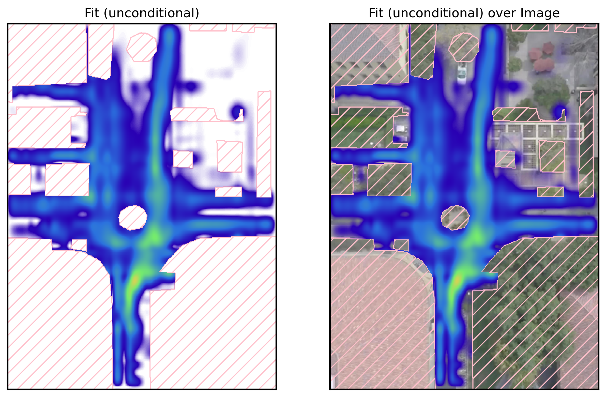

# PAL - A Probabilistic Neuro-symbolic Layer for Algebraic Constraint Satisfaction
[](https://github.com/april-tools/pal/actions/workflows/python-app.yml)

This repo contains the code for PAL, a probabilistic neuro-symbolic layer for algebraic constraint satisfaction.
This is a simplified implementation that focuses on the spline-case.

Check out the paper [here](https://proceedings.mlr.press/v286/kurscheidt25a.html)!

## Example Prediction

This is an example prediction of PAL on the Constrained Stanford Drone Dataset (https://github.com/april-tools/constrained-sdd). We predict a probability distribution over the future trajectory while guaranteeing constraint-satisfaction.




## Citation

Leander Kurscheidt, Paolo Morettin, Roberto Sebastiani, Andrea Passerini, Antonio Vergari, A Probabilistic Neuro-symbolic Layer for Algebraic Constraint Satisfaction, arXiv:2503.19466

# Installation

Just clone it and run:
```bash
./setup.sh
```
And you're ready to go!

# Constrained Stanford Drone Dataset

We provide an example script how to train a simple MLP on the constrained SDD-dataset. A model can be trained like this:

```bash
python pal/training/train_mlp_sdd.py --epochs 10 --init_last_layer_positive --seed 1744909132
```

This should result in a (mean) test log-likelihood of `-1.9149`.

There is also an unconditional variant of the experiment (fig. 1) in the paper. It can be trained like this:

```bash
python pal/training/train_unconditional_sdd.py --init_positive --use_float64 --num_knots 14 --num_mixtures 10 --lr 0.01 --epochs 1500 --seed 1764087361
```

This should result in a (mean) test log-likelihood of `-2.9493`.

# GASP!
The dependency was added via subtree from https://github.com/april-tools/gasp.git into pal/wmi/gasp!
update via:
```bash
git subtree pull --prefix pal/wmi/gasp https://github.com/april-tools/gasp.git main --squash
```
push via:
```bash
git subtree push --prefix pal/wmi/gasp https://github.com/april-tools/gasp.git main
```

# Citation

```
@inproceedings{kurscheidt2025probabilistic,
  title={A Probabilistic Neuro-symbolic Layer for Algebraic Constraint Satisfaction},
  author={Kurscheidt, Leander and Morettin, Paolo and Sebastiani, Roberto and Passerini, Andrea and Vergari, Antonio},
  booktitle={Conference on Uncertainty in Artificial Intelligence},
  pages={2431--2471},
  year={2025},
  organization={PMLR}
}
```
