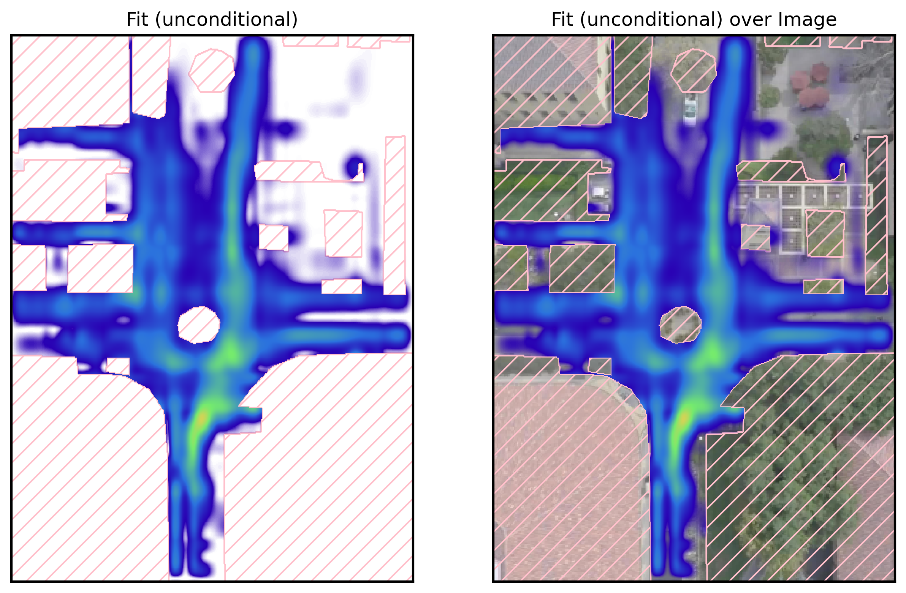

# PAL – A Probabilistic Neuro-symbolic Layer for Algebraic Constraint Satisfaction

[](https://github.com/april-tools/pal/actions/workflows/python-app.yml)

This repository contains the code for **PAL (Probabilistic Algebraic Layer)**, a probabilistic neuro-symbolic layer for algebraic constraint satisfaction.

The original PAL implementation accompanies the paper:

> Leander Kurscheidt, Paolo Morettin, Roberto Sebastiani, Andrea Passerini, Antonio Vergari.
>
> *A Probabilistic Neuro-symbolic Layer for Algebraic Constraint Satisfaction.*
>
> UAI 2025.

The original paper can be found here:

https://proceedings.mlr.press/v286/kurscheidt25a.html

This fork extends the original implementation with a comprehensive experimental framework for investigating the **numerical stability of polynomial basis representations in constrained probabilistic inference**.

The repository now includes the complete experimental code developed for the MSc dissertation:

> *Investigating the Numerical Stability of Polynomial Basis Representations in Constrained Probabilistic Inference.*

---

# Repository Structure

```text
pal/
├── analysis/
│   ├── simplex/          # Degree, dimension, precision, and scaling experiments
│   ├── polytope/         # Convex polytope benchmarks
│   ├── validation/       # Basis validation utilities
│   └── plots/            # Figure-generation scripts
│
├── docs/
│   ├── experiments.md
│   └── experimental_results.md
│
├── figures/              # Dissertation figures
│
├── pal/                  # Original PAL implementation
│
└── data/
```

---

# Repository Components

## Original PAL Implementation

The original PAL implementation includes:

- Spline-based constrained probabilistic inference
- Constrained Stanford Drone Dataset experiments
- PAL training and evaluation pipelines
- Neural trajectory prediction
- Constraint-aware probabilistic modeling

---

## Numerical Stability Extension

The experimental framework extends PAL with:

- Monomial polynomial representations
- Legendre polynomial representations
- Chebyshev polynomial representations
- Conditioning diagnostics
- Numerical rank analysis
- Higher-dimensional experiments
- Floating-point precision studies
- Perturbation analysis
- Constrained integration benchmarks
- Downstream probabilistic inference
- Representative PAL benchmarks

---

# Example PAL Prediction

This example demonstrates PAL on the Constrained Stanford Drone Dataset.

The model predicts a probability distribution over future trajectories while guaranteeing constraint satisfaction.




---

# Installation

Clone the repository:

```bash
git clone https://github.com/k-r-o-y/pal.git

cd pal
```

Run the setup script:

```bash
./setup.sh
```

---

# Original PAL Experiments

## Constrained Stanford Drone Dataset

Train a simple MLP:

```bash
python pal/training/train_mlp_sdd.py \
    --epochs 10 \
    --init_last_layer_positive \
    --seed 1744909132
```

Expected mean test log-likelihood:

```text
-1.9149
```

---

## Unconditional SDD Experiment

Train the unconditional model:

```bash
python pal/training/train_unconditional_sdd.py \
    --init_positive \
    --use_float64 \
    --num_knots 14 \
    --num_mixtures 10 \
    --lr 0.01 \
    --epochs 1500 \
    --seed 1764087361
```

Expected mean test log-likelihood:

```text
-2.9493
```

---

# Numerical Stability Experiments

The experimental framework investigates how polynomial basis representations affect constrained probabilistic inference.

The experiments compare:

- Monomial bases
- Legendre bases
- Chebyshev bases

under increasing:

- Polynomial degree
- Dimensionality
- Constraint complexity
- Floating-point precision
- Perturbation magnitude

---

# Implemented Experiments

| Experiment | Metrics |
| --- | --- |
| Basis equivalence | Functional equivalence, basis conversion |
| Conditioning | Vandermonde conditioning, Gram matrix conditioning |
| Higher dimensions | Scaling, runtime, basis growth |
| Precision | float32 vs float64 |
| Perturbation | Noise amplification, recovery error |
| Downstream inference | Partition function and query probability error |
| Polytope benchmarks | Integration, recovery, runtime |
| PAL benchmarks | End-to-end probabilistic inference |

---

# Experimental Scripts

## Simplex Benchmarks

```text
analysis/simplex/
├── run_simplex_benchmark.py
├── run_dimension_benchmark.py
├── run_precision_benchmark.py
└── run_geometric_scale_benchmark.py
```

---

## Polytope Benchmarks

```text
analysis/polytope/
└── run_polytope_benchmark.py
```

---

## Validation Utilities

```text
analysis/validation/
└── validate_basis.py
```

---

## Plot Generation

```text
analysis/plots/
├── plot_condition_vs_degree.py
├── plot_constraint_gram_benchmark.py
├── plot_dimension_benchmark.py
├── plot_downstream_benchmark.py
├── plot_generated_polynomials.py
├── plot_perturbation_sensitivity_vs_degree.py
├── plot_polytope_benchmark.py
├── plot_polytope_runtime_vs_dimension.py
├── plot_precision_benchmark.py
├── plot_relative_error_vs_degree.py
└── plot_runtime_vs_degree.py
```

---

# Documentation

Additional documentation is available in:

```text
docs/
├── experiments.md
└── experimental_results.md
```

These documents describe:

- Research questions
- Experimental methodology
- Evaluation metrics
- Experimental results
- Numerical findings
- Reproducibility

---

# Reproducibility

The repository includes:

- Deterministic random seeds
- Benchmark scripts
- Plot-generation scripts
- Experimental configurations
- Figure-generation utilities
- Complete dissertation documentation

All figures presented in the accompanying MSc dissertation can be reproduced directly from this repository.

---

# GASP!

The dependency was added via subtree from:

https://github.com/april-tools/gasp.git

Update via:

```bash
git subtree pull \
    --prefix pal/wmi/gasp \
    https://github.com/april-tools/gasp.git \
    main \
    --squash
```

Push via:

```bash
git subtree push \
    --prefix pal/wmi/gasp \
    https://github.com/april-tools/gasp.git \
    main
```

---

# Citation

```bibtex
@inproceedings{kurscheidt2025probabilistic,
  title={A Probabilistic Neuro-symbolic Layer for Algebraic Constraint Satisfaction},
  author={Kurscheidt, Leander and Morettin, Paolo and Sebastiani, Roberto and Passerini, Andrea and Vergari, Antonio},
  booktitle={Conference on Uncertainty in Artificial Intelligence},
  pages={2431--2471},
  year={2025},
  organization={PMLR}
}
```
